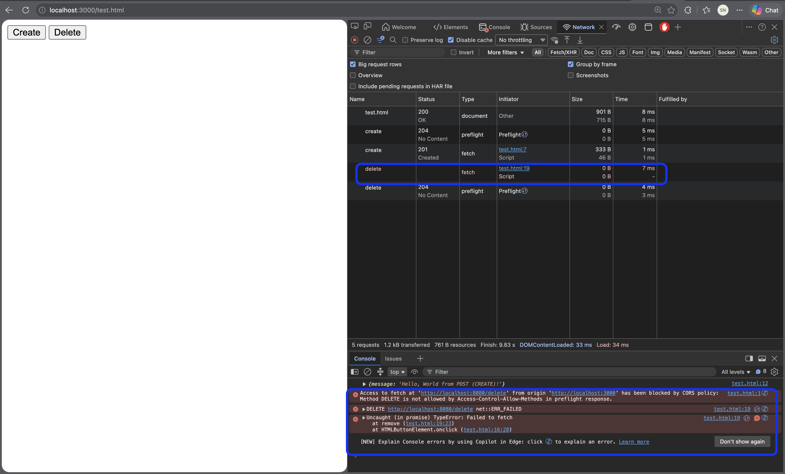
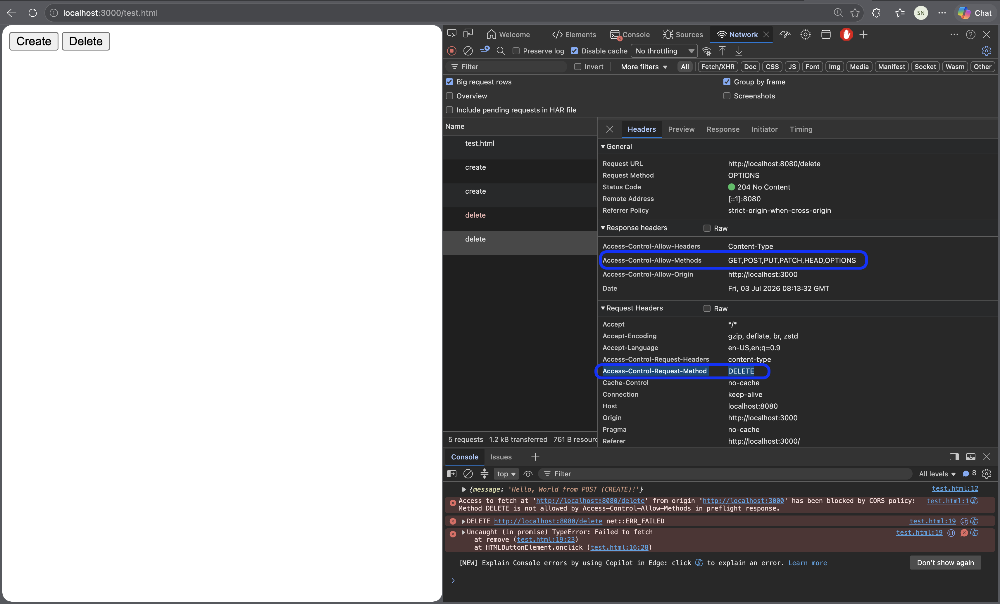
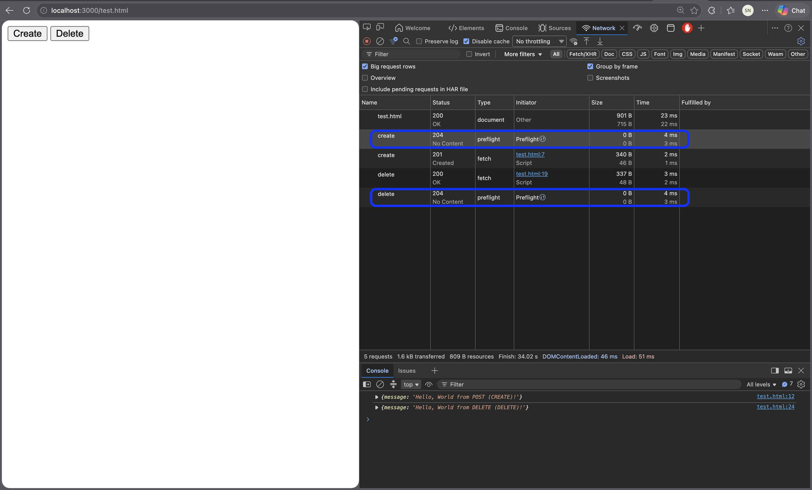
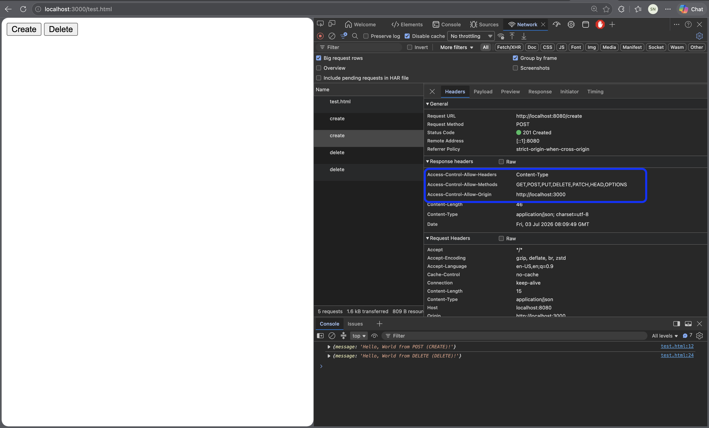

# go-cors

A small Gin API project to learn **CORS (Cross-Origin Resource Sharing)** — why browsers enforce it, how preflight works, and how to configure it in Go.

## What this project does

- **Backend (Gin):** REST endpoints on `http://localhost:8080`
- **Frontend (HTML):** `test.html` served on `http://localhost:3000`
- **CORS middleware:** `middleware/cors.go` — allows cross-origin browser requests from the frontend dev server

```
Browser (localhost:3000)  →  API (localhost:8080)
         different ports = different origins = CORS applies
```

## Project structure

```
go-crud/
├── main.go              # Boot: router, middleware, Run()
├── middleware/cors.go   # CORS headers + OPTIONS preflight
├── handler/user.go      # Request handlers
├── routes/routes.go     # URL → handler wiring
├── models/user.go       # Data structs
└── test.html            # Browser UI to test cross-origin calls
```

## Run locally

**Terminal 1 — API**
```bash
go run .
# or
CompileDaemon -command="./go-crud"
```

**Terminal 2 — Frontend**
```bash
python3 -m http.server 3000
```

Open `http://localhost:3000/test.html` → click **Create** / **Delete** → check DevTools → **Network** tab.

---

## Why does the browser enforce CORS?

CORS is a **browser security policy**. It stops malicious websites from using **your browser session** to call other sites on your behalf.

### Real-world example

You're logged into **bank.com** (session cookie in browser).

You visit **evil-site.com**. Without CORS, evil-site could run:

```javascript
fetch("https://bank.com/api/transfer", {
  method: "POST",
  body: JSON.stringify({ to: "attacker", amount: 10000 }),
  credentials: "include"  // sends your bank cookie!
})
```

**CORS blocks this** — `bank.com` never sends `Access-Control-Allow-Origin: https://evil-site.com`, so the browser refuses to expose the response (and often blocks the request entirely).

> **CORS protects users.** Your API middleware tells the browser: *"Only these frontends may call me from JavaScript."*

---

## What I observed in the browser

### Without CORS middleware

Browser blocks the request. Console error:

```
Access to fetch at 'http://localhost:8080/delete' from origin 'http://localhost:3000'
has been blocked by CORS policy: No 'Access-Control-Allow-Origin' header is present
as DELETE is not in the Access-Control-Allow-Methods
```




Network tab shows:
1. **OPTIONS** `/create` → 404 or missing CORS headers (preflight fails)
2. **POST** `/create` → blocked / failed

---

### With CORS middleware

Preflight passes, then the real request goes through.




Network tab shows **two requests** on button click:

| # | Method | URL | Status | Purpose |
|---|--------|-----|--------|---------|
| 1 | **OPTIONS** | `/create` | 204 | Preflight — browser asks permission |
| 2 | **POST** | `/create` | 201 | Real request — only after preflight passes |

**OPTIONS preflight request headers (browser sends):**
```
Origin: http://localhost:3000
Access-Control-Request-Method: POST
Access-Control-Request-Headers: content-type
```

**OPTIONS response headers (API returns):**
```
Access-Control-Allow-Origin: http://localhost:3000
Access-Control-Allow-Methods: GET,POST,PUT,DELETE,PATCH,HEAD,OPTIONS
Access-Control-Allow-Headers: Content-Type
```

---

## CORS headers explained

| Header | Purpose |
|--------|---------|
| `Access-Control-Allow-Origin` | Which frontend origins may call this API |
| `Access-Control-Allow-Methods` | Which HTTP methods are allowed (PUT, DELETE, PATCH must be listed) |
| `Access-Control-Allow-Headers` | Which request headers the browser may send (e.g. `Content-Type`) |
| `Access-Control-Allow-Credentials` | Whether cookies/auth headers are allowed (`true` / omit) |

> **Note:** GET, POST, HEAD are **CORS-safelisted methods** — browsers always allow them in preflight. PUT, DELETE, PATCH must appear in `Allow-Methods`.

---

## Why `router.Use()` instead of `router.OPTIONS("/some-path")`?

Browser preflight hits the **same URL** as the real request (e.g. `OPTIONS /create`, not `/options`).

- `router.OPTIONS("/options")` → only handles that one path
- `router.Use(middleware.CORS())` → handles **all** paths + attaches CORS headers to every response

This is the standard production pattern.

---

## Origins in this project vs production

**Current code** (`middleware/cors.go`):
```go
c.Header("Access-Control-Allow-Origin", "http://localhost:3000")
```

**Production pattern** — whitelist specific origins:

```go
// Dev
"http://localhost:3000"

// Production
"https://app.google.com"
"https://admin.google.com"
```

Real apps typically use:
- A **list** of allowed origins (dev + staging + prod)
- **Env config:** `ALLOWED_ORIGINS=https://app.example.com,https://staging.example.com`

**Never in production:**
```go
"*"  // allows ANY website to call your API from a browser
```

---

## When CORS is NOT needed

| Scenario | CORS needed? | Why |
|----------|--------------|-----|
| Same host (UI + API on same origin) | No | e.g. `google.com` UI → `google.com/search/...` |
| Server-to-server (K8s, Google Chrome → Google Search Nodes) | No | No browser involved — JWT/token auth instead |
| Postman / curl / backend scripts | No | CORS is browser-only |
| Local dev (Angular `:4200` → API `:8080`) | **Yes** | Cross-origin — whitelist required |
| External plugin / third-party UI | **Yes** | Cross-origin — whitelist required |

Example ( prod config):
```
google_cors_origins = ""   # empty = same-origin design, CORS off by default
                         # set only when something outside that host needs browser access
```

---

## HTTP methods in this API

| Method | Route | Purpose |
|--------|-------|---------|
| GET | `/retrieve` | Read |
| POST | `/create` | Create |
| PUT | `/update` | Full replace |
| PATCH | `/patch` | Partial update |
| DELETE | `/delete` | Remove |
| HEAD | `/head` | Metadata only (no body) |
| OPTIONS | *(middleware)* | Preflight (automatic) |

---

## Key learnings

1. **Different port = different origin** — `localhost:3000` ≠ `localhost:8080`
2. **POST with JSON triggers preflight** — browser sends OPTIONS first
3. **Preflight ≠ route exists** — middleware returns 204 even if POST route is missing
4. **Network tab shows server response even when CORS blocks JS** — check Console too
5. **Postman never shows preflight** — only browsers do
6. **CORS is not auth** — it only controls which origins can read responses in a browser

---

## Additional reading

- [enable-cors.org — Resources](https://enable-cors.org/resources.html)
- [Okta — Enable CORS Guide](https://developer.okta.com/docs/guides/enable-cors/main/)
- [martini-contrib/cors (Go reference)](https://github.com/martini-contrib/cors)
- [web.dev — CORS & Preflight requests](https://web.dev/articles/cross-origin-resource-sharing?utm_source=devtools&utm_campaign=stable#preflight-requests-for-complex-http-calls)
- [MDN — CORS](https://developer.mozilla.org/en-US/docs/Web/HTTP/CORS)

---

## Author

[Sakshi Nasha](https://github.com/wheresNasha)
